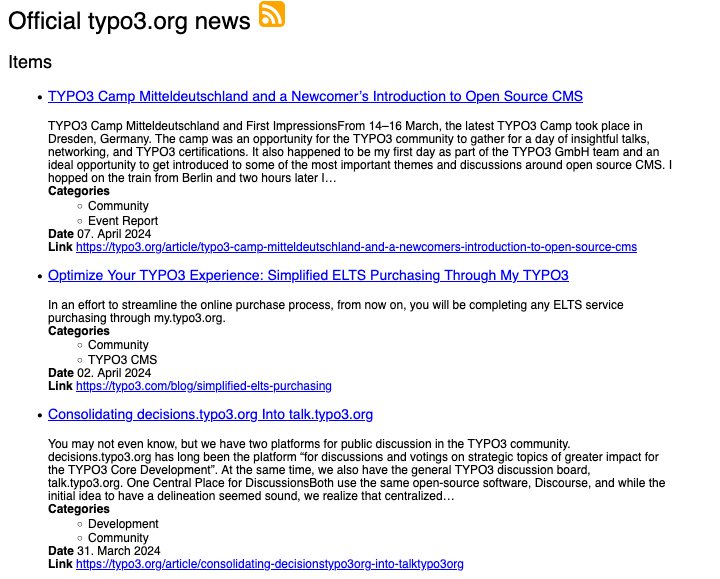
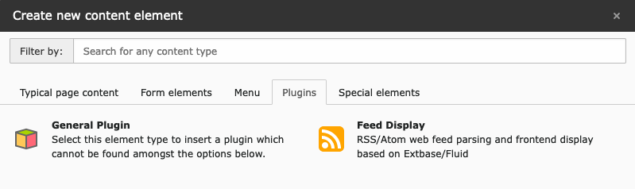
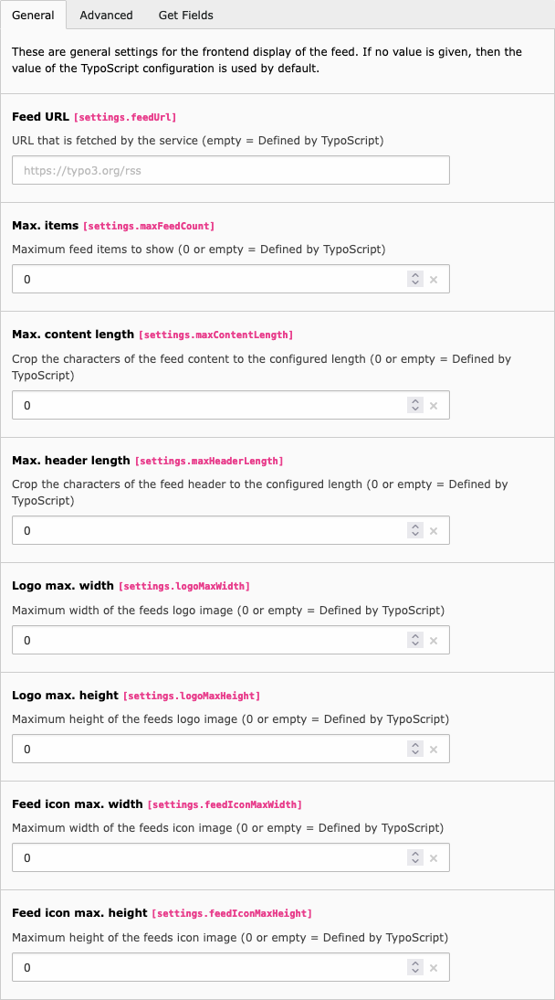
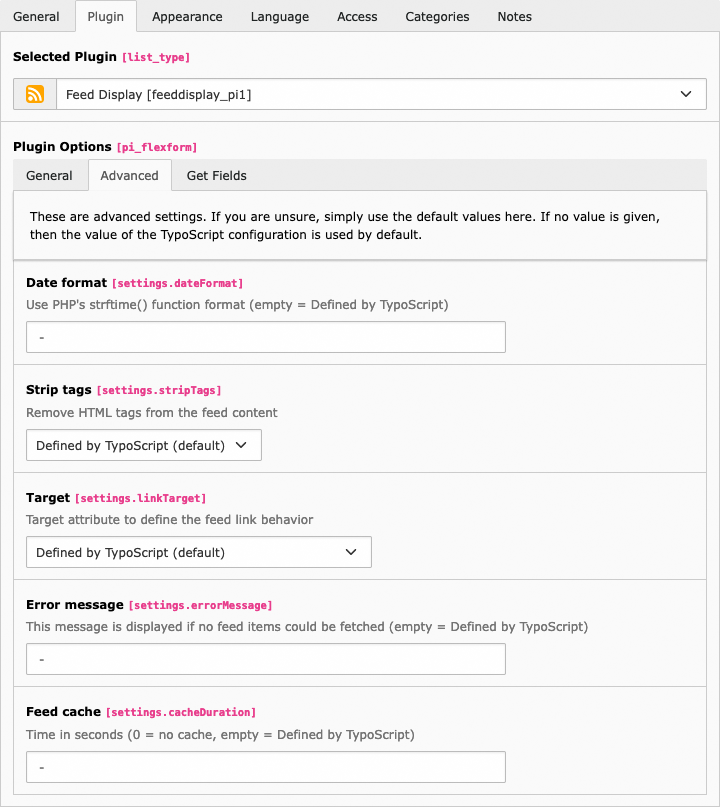
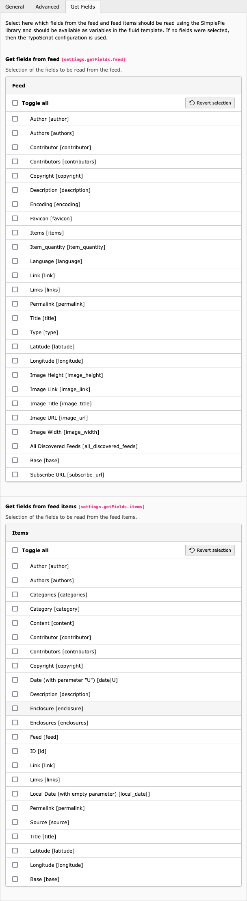
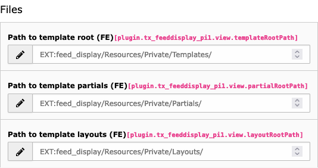
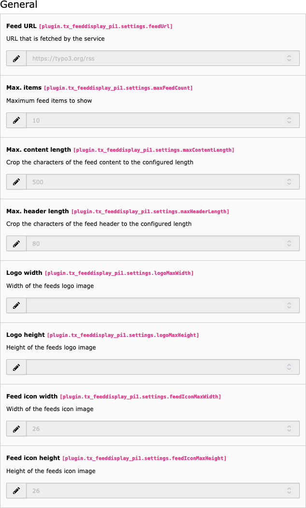
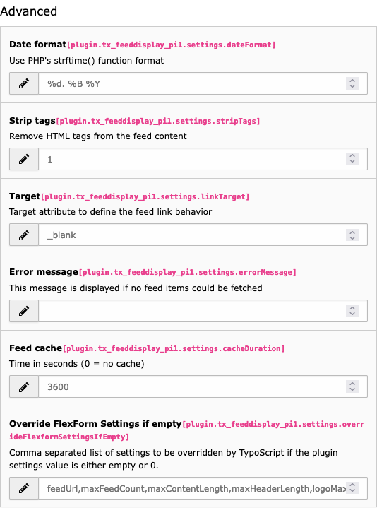
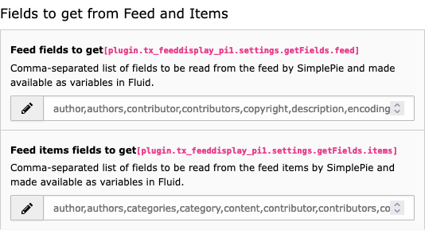

# Feed Display

## What does it do?

The aim of this extension is to provide a way to display RSS and Atom web
feed data retrieved from any URL in the frontend. It is possible to configure
which data is to be read from the feed for the purpose of display.

Parsing of feed data is done by the [SimplePie](https://simplepie.org/)
library, which is a very fast and easy-to-use feed parser, written in PHP.

Remote `http` and `https` feeds are fetched through TYPO3's PSR-17/PSR-18
interfaces. This means instance-wide HTTP client settings such as proxy
configuration are applied automatically. Local feed files and other non-HTTP
sources use SimplePie's default transport.

The entire result is stored in its own cache (using the caching framework)
so that the feed does not have to be parsed with each call. If something has
changed in the plugin configuration (TypoScript or FlexForm), the cache is
renewed immediately, otherwise only after a configurable time has elapsed.

## Screenshots

Here you can find screenshots of all application areas of this extension.

### Frontend View

Below you can find an example of the frontend output of the official TYPO3
news feed. Styling and structure can be customized as you like.



### New Content Element Wizard



### Plugin Settings

Below you can find screenshots of all available plugin options. Use these
options if you want to make settings on content element level.
Alternatively, these can also be configured by TypoScript Constants in the
constant editor.

#### General



#### Advanced



#### Get Fields



### Constant Editor

Below you can find screenshots of all available constants in the constant
editor. Use these options if you want to make settings on a global level for
all content elements.

#### Files



#### General



#### Advanced



#### Get Fields



## Read more

For more information, see the documentation at [docs.typo3.org](https://docs.typo3.org/p/erhaweb/feed-display/main/en-us/).

## Release automation

Publishing to TER is automated with [`.github/workflows/publish-ter.yml`](.github/workflows/publish-ter.yml)
and the official TYPO3 Tailor CLI.

### Required repository secret

Add the repository secret `TYPO3_API_TOKEN` with the scopes
`extension:read,extension:write` and restrict it to `feed_display`.

### Standard release flow

1. Create the release commit and tag it as `x.y.z` without a `v` prefix.
2. Push the commit and tag to GitHub.
3. The workflow checks out the tagged commit, validates the version markers in
   `ext_emconf.php` and `Documentation/Settings.cfg`, generates the TER upload
   comment from the non-merge commit subjects since the previous release tag,
   and publishes the package to TER.

### Manual backfill for an existing tag

If a tag already exists and has not been published yet, start the workflow
manually from `main` and provide the tag name in the `version` input.

With the GitHub CLI this looks like:

```bash
gh workflow run publish-ter.yml --ref main -f version=2.2.0
```

Only one workflow run per release version is allowed at a time. Parallel runs
for the same tag are serialized by the workflow `concurrency` group.

### Manual dry run for an existing tag

To validate packaging without contacting TER, start the same workflow manually
and set `dry_run=true`. The workflow then creates the TER artefact zip, uploads
it as a GitHub Actions artefact, and skips token validation and publication.

With the GitHub CLI this looks like:

```bash
gh workflow run publish-ter.yml --ref main -f version=2.2.0 -f dry_run=true
```

### Local dry run

The helper script validates the checked out release tag and generates the TER
comment locally:

```bash
bash Build/Scripts/prepareTerPublish.sh 2.2.0
```

To create a local TER artefact with Tailor, install the pinned version and use
the packaging exclusions from `Build/Tailor/ExcludeFromPackaging.php`:

```bash
COMPOSER_HOME="${PWD}/.Build/.composer" composer global require typo3/tailor:1.7.0
TYPO3_EXCLUDE_FROM_PACKAGING=Build/Tailor/ExcludeFromPackaging.php \
  php .Build/.composer/vendor/bin/tailor create-artefact 2.2.0 --path=.
bash Build/Scripts/verifyTerArtefact.sh tailor-version-artefact/feed_display_2.2.0.zip
```
