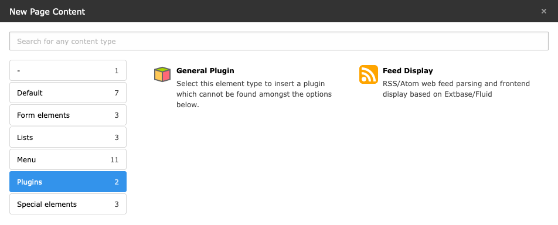
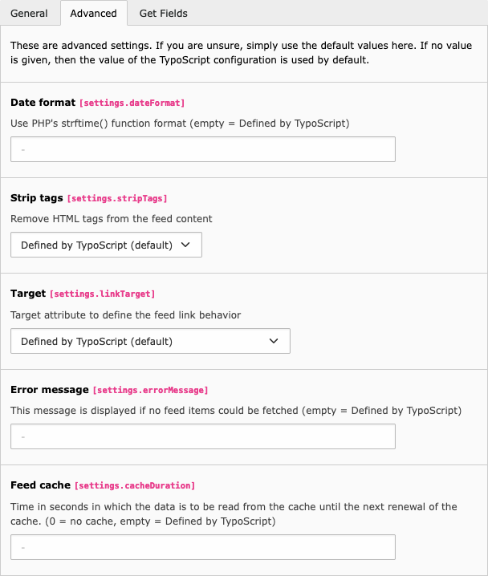
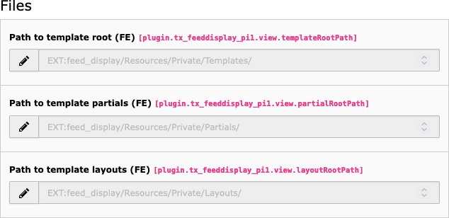
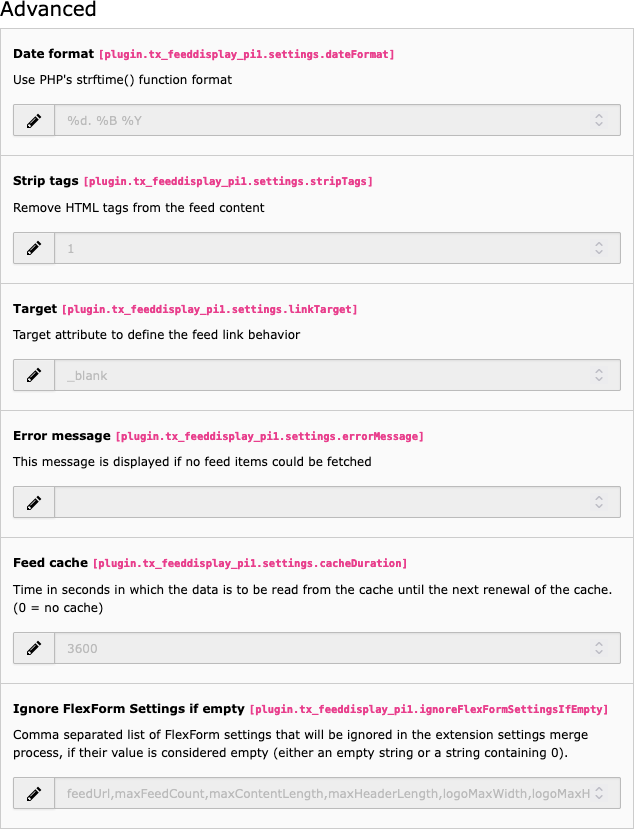

# Feed Display

## What does it do?

The aim of this extension is to provide a way to display RSS and Atom web
feed data retrieved from any URL in the frontend. It is possible to configure
which data is to be read from the feed for the purpose of display.

Parsing of feed data is done by the [SimplePie](https://simplepie.org/)
library, which is a very fast and easy-to-use feed parser, written in PHP.

The entire result is stored in its own cache (using the caching framework)
so that the feed does not have to be parsed with each call. If something has
changed in the plugin configuration (TypoScript or FlexForm), the cache is
renewed immediately, otherwise only after a configurable time has elapsed.

## Screenshots

Here you can find screenshots of all application areas of this extension.

### Frontend View

Below you can find an example of the frontend output of the official TYPO3
news feed. Styling and structure can be customized as you like.

### New Content Element Wizard

### Plugin Settings

Below you can find screenshots of all available plugin options. Use these
options if you want to make settings on content element level.
Alternatively, these can also be configured by TypoScript Constants in the
constant editor.

#### General

#### Advanced

#### Get Fields

### Constant Editor

Below you can find screenshots of all available constants in the constant
editor. Use these options if you want to make settings on a global level for
all content elements.

#### Files

#### General

#### Advanced

#### Get Fields

## Read more

For more information, see the documentation at [docs.typo3.org](https://docs.typo3.org/p/erhaweb/feed-display/main/en-us/).